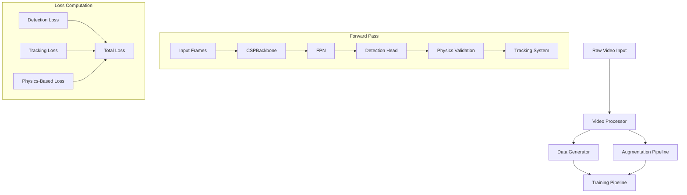
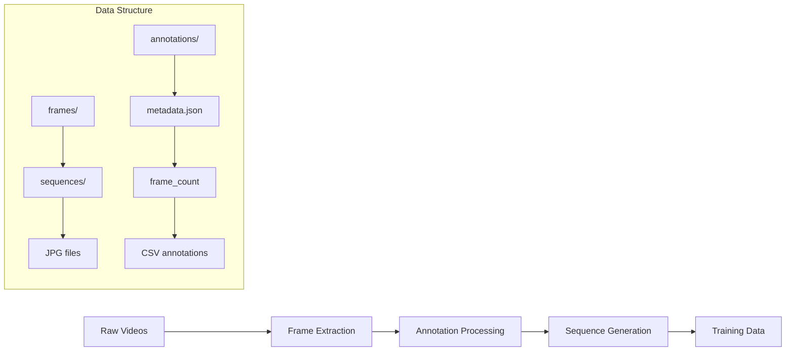

# BadmintonShuttleCockDetection 🏸

A state-of-the-art AI system that combines physics-informed neural networks with hybrid deep learning architecture to achieve high-precision shuttlecock detection and trajectory prediction in high-speed badminton matches.

Advanced AI-powered Badminton Shuttlecock Detection and Tracking System with Physics-Informed Neural Networks and Hybrid Architecture

## Overview 🔍

This project implements a state-of-the-art shuttlecock detection and tracking system using a hybrid neural network architecture enhanced with physics-informed modeling. The system combines deep learning with aerodynamic principles to achieve high-accuracy tracking in high-speed badminton matches.

## System Architecture 🏗️



## Model Components 🔧

```
Final Model Structure
├── Detection Engine
│   ├── CSPDarknet Backbone (Feature Extraction)
│   ├── FPN (Multi-scale Features)
│   └── Custom Detection Head
│
├── Physics Engine
│   ├── Trajectory Validator
│   ├── PINN (Physics-Informed Neural Network)
│   └── Motion Models
│
├── Tracking System
│   ├── Modified DeepSORT
│   ├── Trajectory Predictor
│   └── Kalman Filter
│
└── Optimization Layer
    ├── TensorRT Optimizations
    ├── Quantization
    └── Model Pruning
```

## Data Pipeline 📊



## Features ✨

- **Hybrid Neural Network Architecture**
  - CSPDarknet backbone for robust feature extraction
  - Feature Pyramid Network for multi-scale detection
  - Custom detection head with physics integration

- **Physics-Informed Components**
  - Air resistance modeling with real-world parameters
  - Magnus effect calculations for spin effects
  - Trajectory feasibility validation using physics constraints

- **Advanced Tracking System**
  - Modified DeepSORT with shuttlecock-specific optimizations
  - Physics-Informed Neural Network (PINN) for trajectory refinement
  - Custom appearance feature extractor for high-speed tracking
  - Kalman filter with badminton-specific motion model

- **High-Performance Optimization**
  - Distributed training with multi-GPU support
  - GPU memory optimization for large batches
  - TensorRT acceleration for inference
  - Model quantization and pruning

## TODO Progress 📝

1. Project Setup and Data Preparation
   - [✓] Setup development environment and dependencies
   - [✓] Create project structure and documentation
   - [✓] Data preprocessing pipeline setup
   - [✓] Data validation and quality checks
   - [✓] Create data generators/loaders
   - [✓] Implement data augmentation strategies

2. Dataset Analysis and Visualization
   - [✓] Analyze frame distribution statistics
   - [✓] Visualize shuttlecock trajectories
   - [✓] Generate heatmaps of shuttlecock positions
   - [✓] Analyze velocity and acceleration patterns
   - [✓] Create dataset insights documentation

3. Hybrid Model Architecture Development
   - [✓] Feature Extraction Module:
       - CSPBackbone architecture
       - Feature Pyramid Network (FPN)
       - Multi-scale feature handling
   
   - [✓] Detection Module:
       - Region Proposal Network (RPN)
       - Detection head
       - Custom fusion module
   
   - [✓] Physics-Informed Components:
       - Physics-informed loss functions
       - Air resistance modeling
       - Magnus effect calculations
       - Trajectory feasibility validator

4. Tracking System Implementation
   - [✓] Core Tracking Components:
       - Modified DeepSORT with shuttlecock optimizations
       - Physics-informed neural network (PINN)
       - Custom appearance feature extractor
   
   - [✓] Trajectory Prediction:
       - LSTM/GRU-based prediction
       - Transformer-based temporal attention
       - Kalman filter with badminton-specific motion model
   
   - [✓] Optimization Components:
       - High-speed object optimization
       - Trajectory smoothing system
       - Interpolation mechanism
       - Confidence scoring with physics validation

5. Training Infrastructure Setup
   - [✓] Training Environment:
       - Distributed training capability
       - Checkpointing system
       - Logging and monitoring
   
   - [✓] Resource Management:
       - GPU memory management
       - Gradient accumulation
       - Mixed precision training

6. Visualization and Analysis Tools
   - [✓] Real-time Visualization
   - [✓] Analysis Tools
   - [✓] Interactive Dashboard

7. Data Preprocessing and Validation
   - [✓] Video Processing
   - [✓] Data Pipeline

8. Testing and Evaluation
   - [✓] Unit Tests
   - [✓] Integration Tests
   - [✓] Performance Metrics

9. Model Fine-tuning and Optimization
   - [🔄] Performance Tuning:
       - Analyze training bottlenecks
       - Optimize batch processing
       - Implement learning rate scheduling

## Installation 🚀

1. Clone the repository:
```bash
git clone https://github.com/MaheshSharan/BadmintonShuttleCockDetection.git
cd BadmintonShuttleCockDetection
```

2. Install dependencies:
```bash
pip install -r requirements.txt
pip install -e .
```

## Training Pipeline 🔄

1. Data Preprocessing:
```bash
python -m src.data.preprocess_dataset
```

2. Training:
```bash
python -m src.main
```

3. Monitor with TensorBoard:
```bash
tensorboard --logdir logs
```

## Google Colab Training 🌐

For training on Google Colab:
1. Upload raw dataset to Google Drive
2. Open `notebook/training_pipeline.ipynb` in Colab
3. Follow the notebook instructions for:
   - Environment setup
   - Data preprocessing
   - Model training
   - Result visualization

## Technical Details 🔧

- **Language**: Python 3.9+
- **Frameworks**: PyTorch, OpenCV
- **Acceleration**: CUDA, TensorRT
- **Visualization**: TensorBoard
- **Training**: Distributed Training Support

## Project Structure 📁

```
BadmintonShuttleCockDetection/
├── config/                 # Configuration files
├── docs/                  # Documentation
├── notebook/              # Jupyter notebooks
├── src/                   # Source code
│   ├── data/             # Data processing
│   ├── models/           # Model implementations
│   ├── training/         # Training modules
│   └── visualization/    # Visualization tools
├── tests/                # Unit tests
└── requirements.txt      # Dependencies
```

## Contributing 🤝

1. Fork the repository
2. Create your feature branch
3. Commit your changes
4. Push to the branch
5. Create a Pull Request

## License 📄

This project is licensed under the MIT License - see the [LICENSE](LICENSE) file for details.

## Acknowledgments 🙏

- Physics-informed neural network implementations
- DeepSORT tracking system
- CSPDarknet architecture

## Author ✍️

**Mahesh Sharan** - [GitHub](https://github.com/MaheshSharan)
