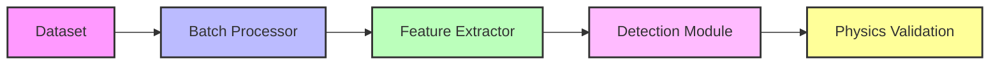
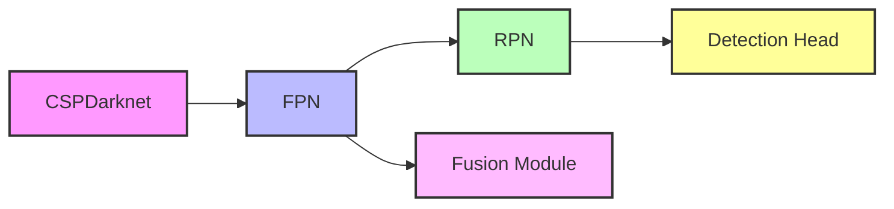
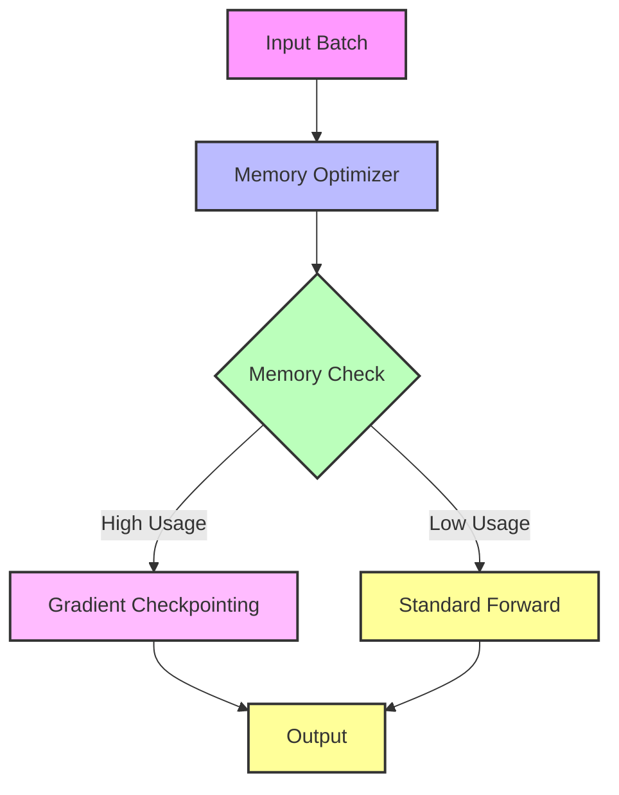

# Badminton Shuttlecock Detection System Architecture

## System Overview

### Main Pipeline Flow


### Feature Extraction Flow


## Component Details

### 1. Data Processing Pipeline
- **Input**: Raw video frames from ShuttleCockFrameDataset
  - Train/Valid split structure
  - Image size: [1280, 720]
- **Augmentation**: Real-time data augmentation
- **Output**: Normalized tensor batches

### 2. Feature Extraction Module
- **CSPDarknet Backbone**
  - Input: [1280, 720] images
  - Feature strides: [4, 8, 16, 32, 64]
  - Output: Multi-scale feature maps

- **Feature Pyramid Network (FPN)**
  - Top-down pathway
  - Lateral connections
  - Feature fusion

### 3. Detection Module
- **Region Proposal Network (RPN)**
  - Anchor scales: [8, 16, 32]
  - Anchor ratios: [0.5, 1.0, 2.0]
  - Multi-scale feature processing

- **Detection Head**
  - Classification branch
  - Regression branch
  - Feature fusion module

### 4. Physics-Informed Components
- **Trajectory Validation**
  ```mermaid
  graph TD
      A[Detection Output] --> B[Air Resistance Model]
      A --> C[Magnus Effect Model]
      B --> D[Trajectory Validator]
      C --> D
      D --> E[Valid/Invalid Trajectory]
      style A fill:#f9f,stroke:#333,stroke-width:2px
      style B fill:#bbf,stroke:#333,stroke-width:2px
      style C fill:#bfb,stroke:#333,stroke-width:2px
      style D fill:#fbf,stroke:#333,stroke-width:2px
      style E fill:#ff9,stroke:#333,stroke-width:2px
  ```

### 5. Optimization Framework
- **Batch Processing**
  - Dynamic batch sizing
  - Gradient accumulation
  - Mixed precision training

- **Memory Optimization**
  - Gradient checkpointing
  - Memory caching
  - Efficient tensor management

- **GPU Optimization**
  - Multi-GPU support
  - Mixed precision
  - Asynchronous data loading

## Key Parameters

### Physics Parameters
```yaml
physics_params:
  shuttlecock_mass: 0.005  # kg
  drag_coefficient: 0.6
  lift_coefficient: 0.4
  air_density: 1.225  # kg/m³
  gravity: 9.81  # m/s²
  cross_section: 0.00125  # m²
  characteristic_length: 0.065  # m
```

### Model Parameters
```yaml
model_params:
  input_size: [1280, 720]
  feature_strides: [4, 8, 16, 32, 64]
  anchor_scales: [8, 16, 32]
  anchor_ratios: [0.5, 1.0, 2.0]
```

## Performance Optimization

### Memory Management Flow


## Research Notes

### Key Innovations
1. Physics-informed validation for trajectory prediction
2. Hybrid architecture combining deep learning with physical constraints
3. Efficient optimization framework for real-time processing
4. Multi-scale feature fusion with physics-guided attention

### Performance Metrics
- Detection accuracy
- Trajectory prediction accuracy
- Real-time processing capability
- Memory efficiency
- GPU utilization

